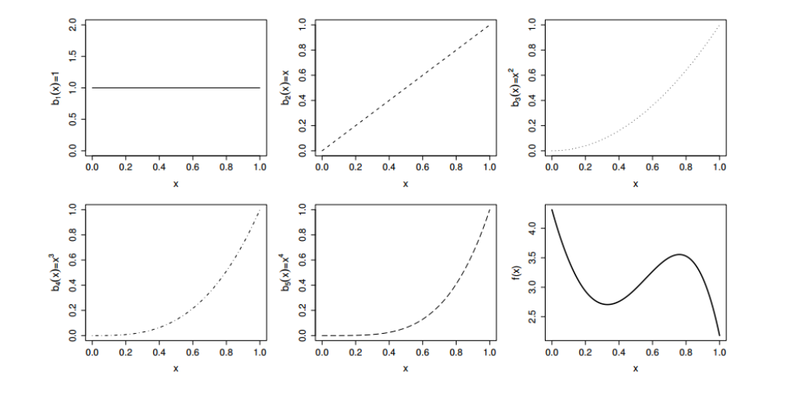
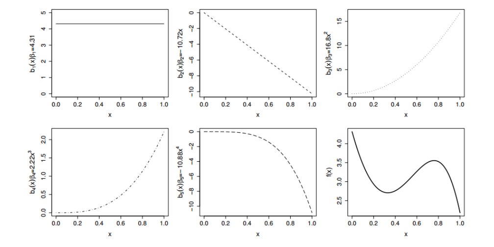
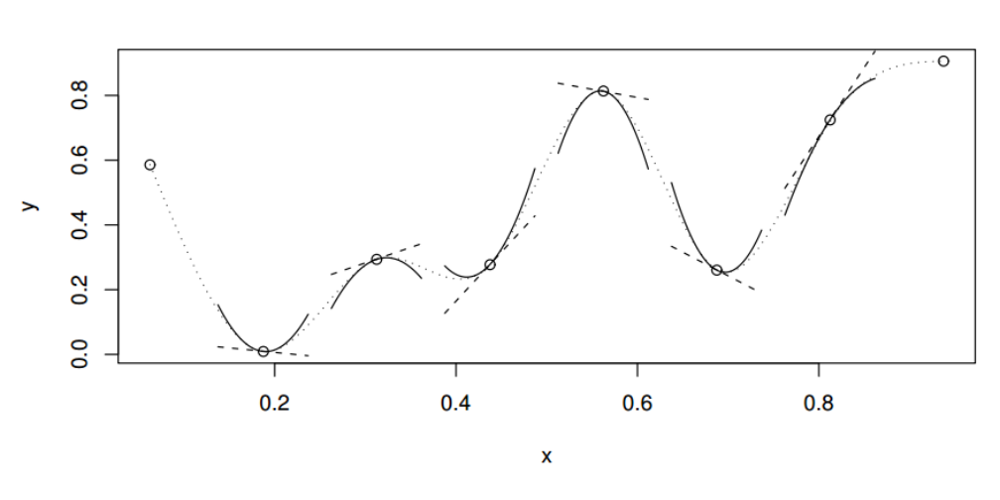
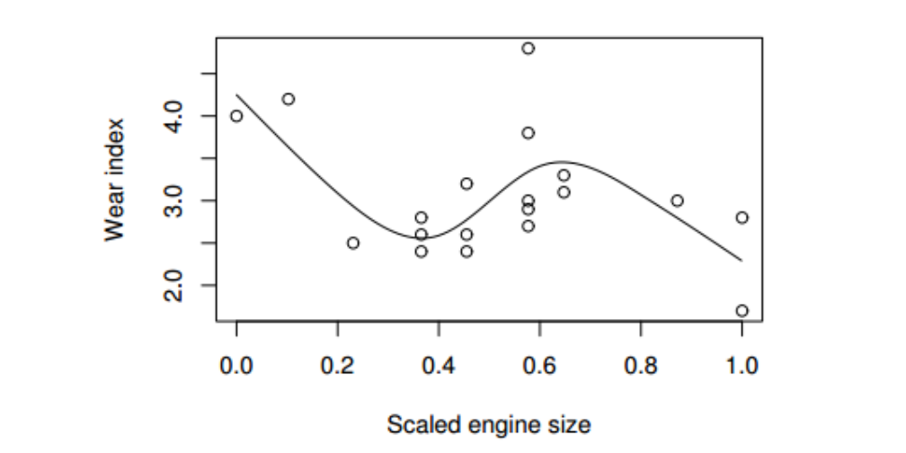
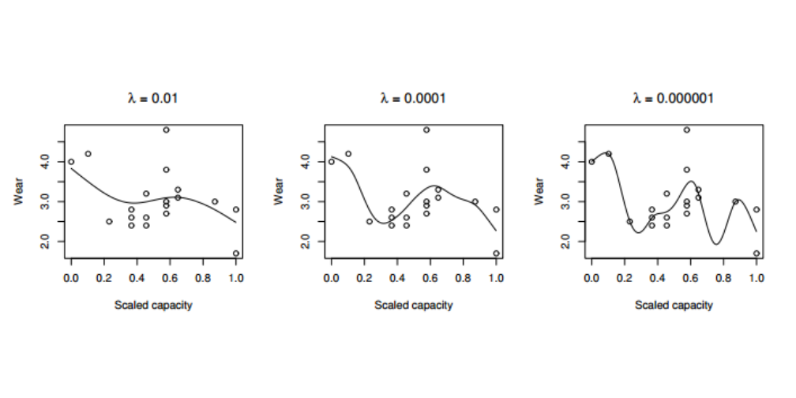

========================================================
Generalized Addative Models
========================================================

A generalized additive model (GAM) is a generalized linear model with a linear predictor involving a sum of smooth functions of covariates. GAMs are used often for the case when you have no a priori reason for choosing a particular response function (such as linear, quadratic, etc.) and want the data to 'speak for themselves'. 

For example:
$$
g(\mu_i) = {\chi_i^*}\theta + f_1(x_{1i}) + f_2(x_{2i}) + f_3(x_{3i},x_{4i}) + \ldots
$$

where

$$
\text{$\mu_i \equiv E (Y_i)$ and $Y_i \thicksim$ some exponential family distribution}
$$

$Y_i$ is a response variable, ${\chi_i^*}$ is a row of the model matrix for any strictly parametric model components, $\theta$ is the corresponding parameter vector, and the $f_j$ are smooth functions of the covariates, $x_k$.

**Pros**
+ rather flexible specification of the dependence of the response on the covariates
+ less unwieldy than linear models

**Cons**
+ new theoretical issues
    - smooth function representation
    - determining degree of smoothness

Univariate smooth functions
===============================

The representatioun of smooth functions is best introduced by considering a model containing one smooth function of one covariate,

$$
y_i = f(x_i) + \epsilon_i
$$

where $y_i$ is a response variable, $x_i$ is a covariate, $f$ a smooth function and $\epsilon_i$} are i.i.d. $N(0,\sigma^2)$ random variables. To further simplify matters, suppose that the $x_i$ lie in the interval $[0,1]$.

Representing a smooth function: regression splines
------------------------------------------------------

In order to extimate $f$ using regression it must be represented in a such a way that it becomes a linear model. This can be done by choosing a *basis*, defining the space of functions of which $f$ (or a close approximation to it) is an element. Choosing a basis, amounts to choosing some *basis functions*, which will be treated as completly known: if $B_i(x)$ is the $i^{th}$ such basis function, then $f$ is assumed to have a represention

$$
f(x) = \sum_{i=1}^q b_i(x)\beta_i
$$

for some values of the unknown parameters, $\beta_i$.

A very simple example: a polynomial basis
----------------------------------------------

As a simple example, suppose that $f$ is believed to be a 4th order polynomial, so that the space of polnomials of order 4 and below contains $f$. A basis for this space is $b_1(x)=1$, $b_2(x)=x$, $b_3(x)=x^2$, $b_4(x)=x^3$ and $b_5(x)=x^4$, so the equations above become

$$
f(x) = \beta_1 + x\beta_2 + x^2\beta_3 + x^3\beta_4 + x^4\beta_4
$$

and

$$
y_i = \beta_1 + x_i\beta_2 + x_i^2\beta_3 + x_i^3\beta_4 + x_i^4\beta_4 + \epsilon_i
$$

Polynomial bases tend to be very useful for situations in which interest focuses on properties of $f$ in the vicinity of a single specified point, but when the questions of interest related to $f$ over its whole domain (currently $[0,1]$), the polynomial bases have some problems. The *spline* bases perform well in such circumstances, largely because they can be shown to have good approximation theoretic properties.

**The first 5 panels (starting from the top left) lillustrate the 5 basis functions, $b_j(x)$, for a 4th order polynomial basis. The basis functions are each multiplied b a real valued parameter, $\beta_j$, and are then summed to give the final curve $f(x)$, and example of which is shown in the bottom right panel. By varying the $\beta_j$, we can vary the form of $f(x)$, to produce any polynomial function of the order 4 or lower.**
 

**An alternative illustration of how a function is represented in terms of basis functions.**
 

**A cubic spline is a curve constructed from sections of cubic polynomial joined
together so that the curve is continuous up to second derivative. The spline shown (dotted
curve) is made up of 7 sections of cubic. The points at which they are joined (◦) (and the
two end points) are known as the knots of the spline. Each section of cubic has different
coefficients, but at the knots it will match its neighbouring sections in value and first two
derivatives. Straight dashed lines show the gradients of the spline at the knots and the curved
continuous lines are quadratics matching the first and second derivatives at the knots: these
illustrate the continuity of first and second derivatives across the knots. This spline has zero
second derivatives at the end knots: a 'natural spline'.**
 

 

 
